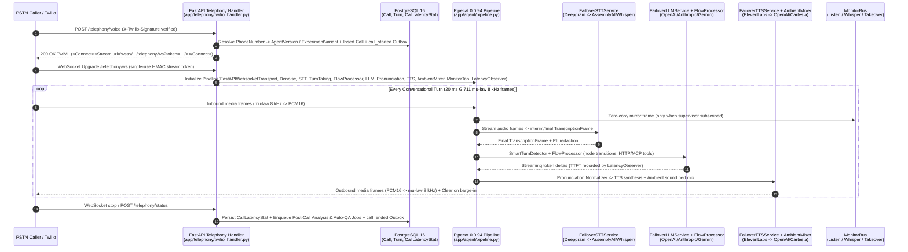
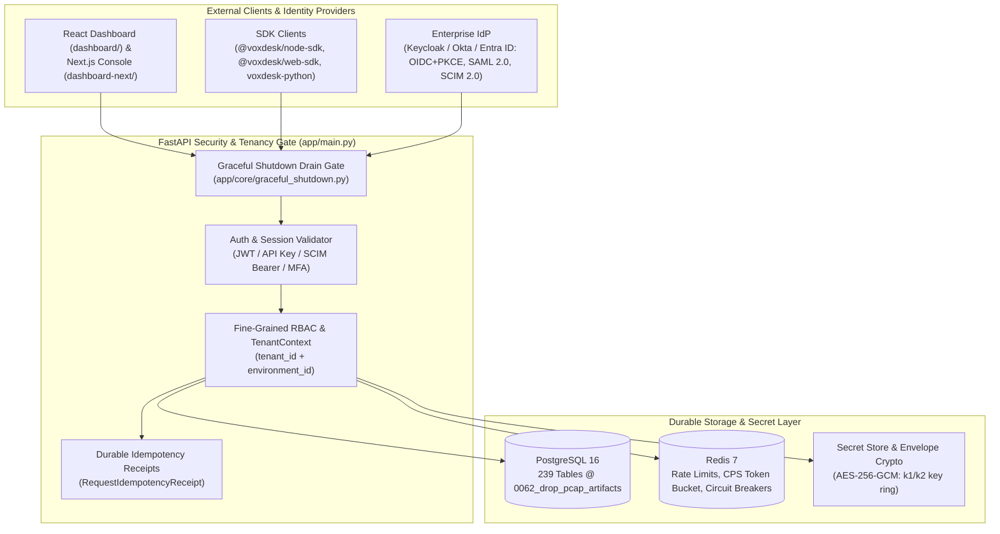
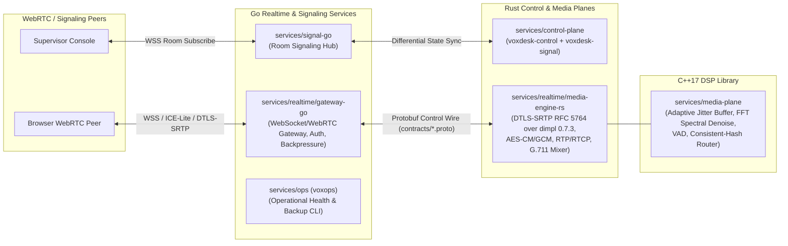
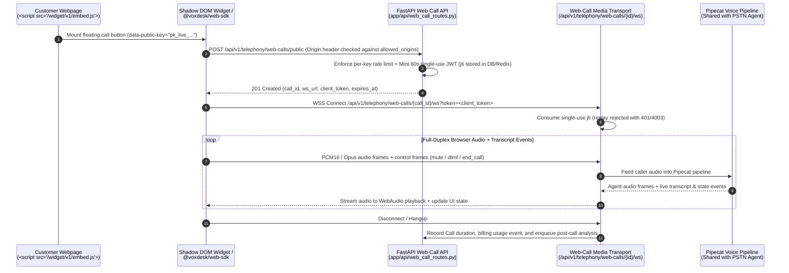

# VoxDesk — System Architecture & Data-Flow Diagrams

This document provides the due-diligence architecture reference for the VoxDesk
Voice AI Platform (`voxdesk-call`), with five Mermaid diagrams covering every
runtime plane:
1. **Live PSTN Call Path** (`/telephony/voice` -> `/telephony/ws` -> Pipecat 0.0.94 pipeline)
2. **Multi-Tenant Control Plane & Identity Boundary**
3. **Durable Jobs & Transactional Outbox (`SELECT ... FOR UPDATE SKIP LOCKED`)**
4. **Polyglot Realtime Gateway, Rust Media Engine SFU & Signaling Hub**
5. **Browser Web-Call & Embeddable Widget Path**

---

## 1. Live PSTN Call Path (`/telephony/voice` & `/telephony/ws`)



---

## 2. Multi-Tenant Control Plane & Identity Boundary



---

## 3. Durable Jobs & Transactional Outbox (`SELECT ... FOR UPDATE SKIP LOCKED`)

```mermaid
sequenceDiagram
    autonumber
    participant Route as API Route / Telephony Callback
    participant PG as PostgreSQL 16<br/>(Same DB Transaction)
    participant Sched as Scheduler Worker<br/>(scripts/scheduler.py)
    participant SSRF as SSRF & DNS Guard<br/>(app/core/ssrf.py)
    participant Ext as Customer Webhook Receiver / Salesforce / LLM

    Route->>PG: BEGIN; Mutate domain row (Call / DNC / Review / Batch)
    Route->>PG: INSERT AuditLog + OutboxEvent / Job (status='pending')
    Route->>PG: COMMIT (Atomic: audit/outbox failure rolls back domain mutation)

    loop Worker Poll Loop (Multi-Worker Safe)
        Sched->>PG: SELECT ... FROM outbox_events / jobs WHERE status='pending' FOR UPDATE SKIP LOCKED
        PG-->>Sched: Claimed batch (locked to worker instance)
        Sched->>SSRF: Validate target URL + resolved A/AAAA records (block RFC1918/loopback/169.254.169.254)
        SSRF-->>Sched: Validated public endpoint
        Sched->>Ext: Signed HTTP POST (X-VoxDesk-Signature: t=...,v1=<hmac_sha256>)
        alt HTTP 2xx Success
            Ext-->>Sched: 200 OK
            Sched->>PG: Mark status='delivered', record latency & HTTP status
        else Transient 5xx / Timeout
            Ext-->>Sched: 503 / Timeout
            Sched->>PG: Increment attempts, schedule exponential backoff retry (or move to 'dlq' at max_attempts)
        end
    end
```

---

## 4. Polyglot Realtime Gateway, Rust Media Engine SFU & Signaling Hub



---

## 5. Browser Web-Call & Embeddable Widget Path


